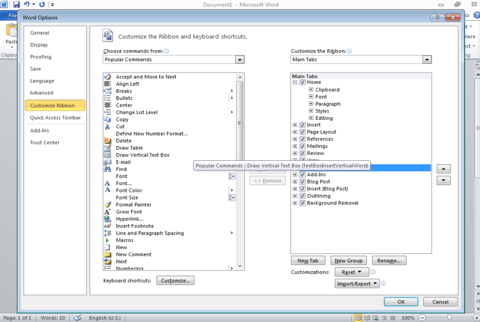
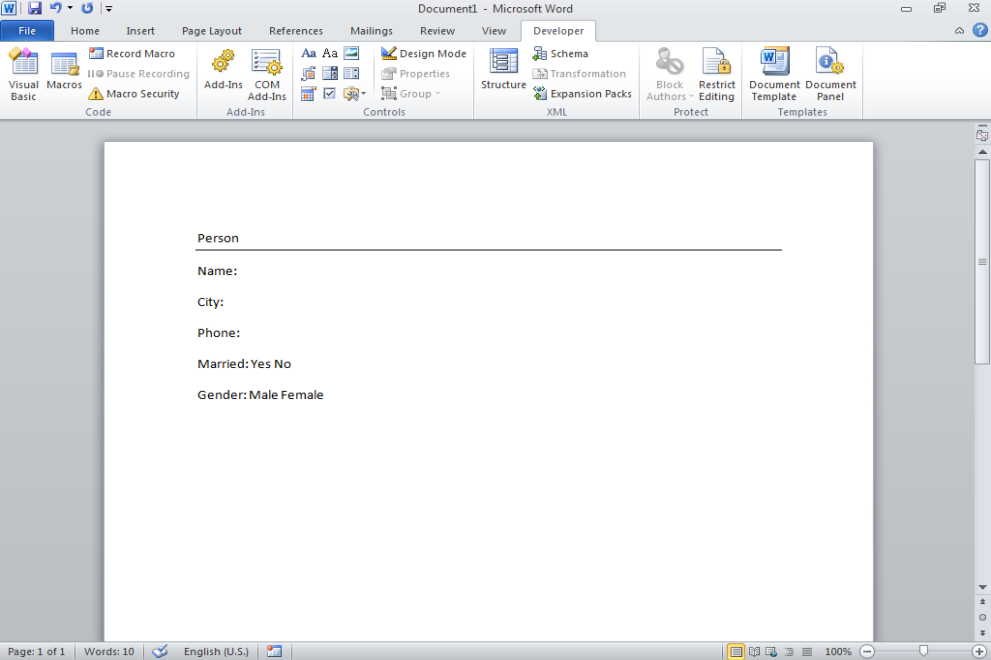
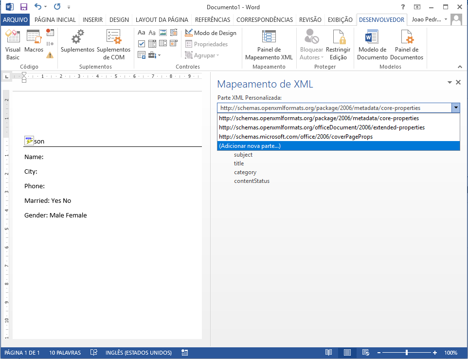
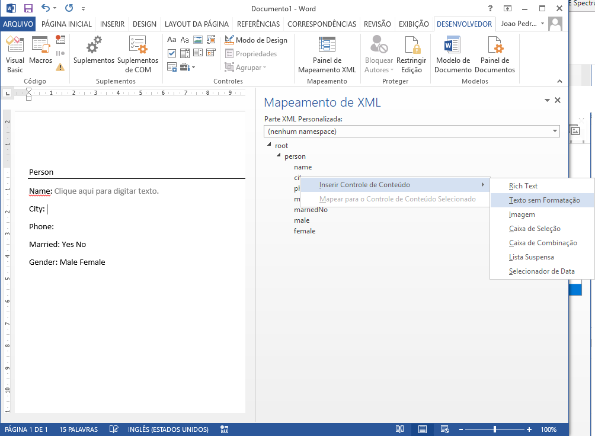
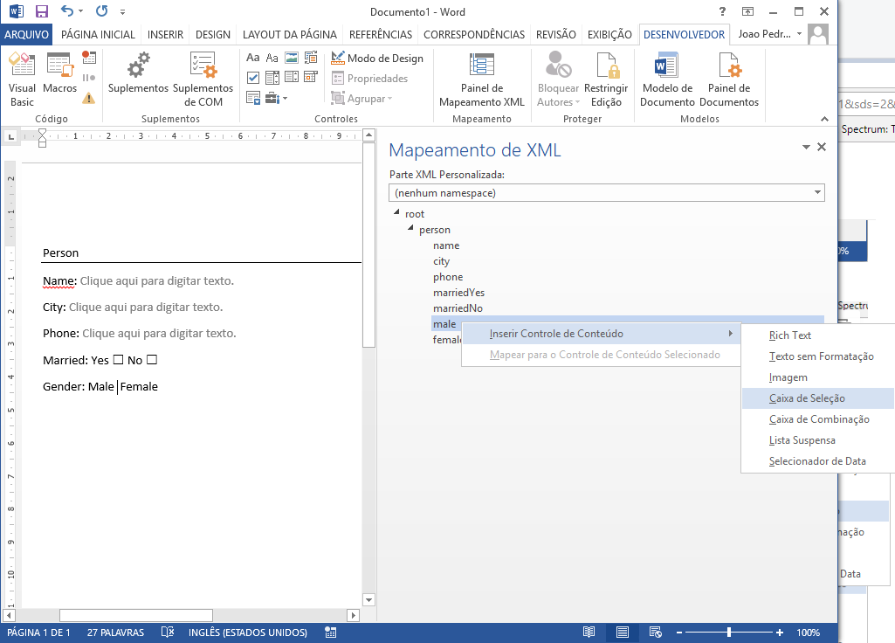
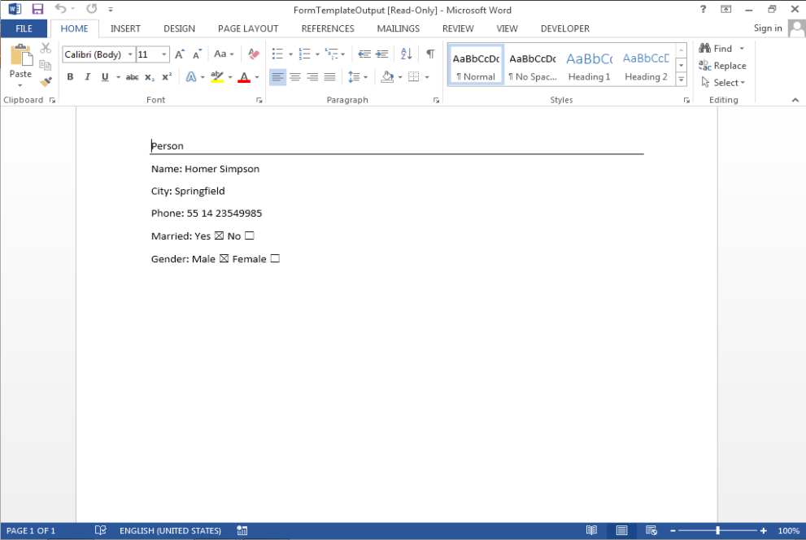

# A Java-based application used to fill Word (docx) files.

## Introduction

Companies are every time demanding more automation tools for documents generation, these tools are used to speed up contracts generation and client documentation. To support this necessity, tools like Word have been widely used integrated with different technologies to fill data in template files. In this context, the Java programming language combined with the library DOCX4J allow, by programming, generate Word documents files filled with data from XML files. However, besides the extensive library documentation and community support available in the internet, there is still a lack for simple guides, and this article proposes to offer a very simple guide (step-by-step) to generate Word document files using the DOCX4J library.

## Guide to generate Word files with Java

Word document files generation is based on XML source files. In this example, the XML structure used to fill the Word document template is presented below:

```xml
<?xml version="1.0" encoding="UTF-8" standalone="yes"?>
<root>
    <person>
        <name></name>
        <city></city>
        <phone></phone>
        <marriedYes></marriedYes>
        <marriedNo></marriedNo>
        <male></male>
        <female></female>
    </person>
</root>
```

With the XML structure defined, open the Word and enable the developer mode following the steps below (Figure 1):
* Select File tab > Options > Customize Ribbon
* On the right side of the Word options box, select "Main Tabs" and mark the "Developer" checkbox.
* Click OK.

| [](images/DeveloperTab.png)  |
|:---:|
| Figure 1: Word 2013 Developer Tab |

With the Developer tab activated, create a simple document template (Figure 2).

| [](images/DocSimple.png)  |
|:---:|
| Figure 2: Simple Document |

After that, go to the Developer Tab and click in the "XML Mapping Pane" button to open XML data configuration, then in the "Custom XML Part" combo select "Add a new part" (Figure 3).

| [](images/AddXmlStructure.png)  |
|:---:|
| Figure 3: Add XML Structure |

Select our new XML structure with the name (no namespace), and use the text cursor to select a position for the control, after that, add a new Plain Text control using the XML Structure. An example is presented at Figure 4.

| [](images/AddControls.png)  |
|:---:|
| Figure 4: Add Input Text Control |

To exemplify another control example, figure 5 illustrate a checkbox configuration.

| [](images/AddCheckControl.png)  |
|:---:|
| Figure 5: Add Checkbox Text Control |

Finally, save the Word document and create a simple Java project using the [DOCX4J](https://www.docx4java.org/) library. The code necessary to process the Word document is presented below.

```java
package com.github.schmittjoaopedro;

import org.docx4j.Docx4J;
import org.docx4j.openpackaging.packages.WordprocessingMLPackage;

import java.io.File;
import java.io.FileInputStream;

public class WordTest {

    public static final String input_DOCX = "E:\\Temp5\\Word document template.docx";

    public static final String input_XML = "E:\\Temp5\\Word document data.xml";

    public static final String output_DOCX = "E:\\Temp5\\Word document output.docx";

    public static void main(String[] args) throws Exception {
        WordprocessingMLPackage wordMLPackage = Docx4J.load(new File(input_DOCX));
        FileInputStream xmlStream = new FileInputStream(new File(input_XML));
        Docx4J.bind(wordMLPackage, xmlStream, Docx4J.FLAG_BIND_INSERT_XML | Docx4J.FLAG_BIND_BIND_XML | Docx4J.FLAG_BIND_REMOVE_SDT);
        Docx4J.save(wordMLPackage, new File(output_DOCX), Docx4J.FLAG_NONE);
        System.out.println("Saved: " + output_DOCX);
    }

}
```

Execute the above program with the XML data presented below.

```xml
<?xml version="1.0" encoding="UTF-8" standalone="yes"?>
<root>
    <person>
        <name>Homer Simpson</name>
        <city>Springfield</city>
        <phone>55 14 23549985</phone>
        <marriedYes>true</marriedYes>
        <marriedNo>false</marriedNo>
        <male>true</male>
        <female>false</female>
    </person>
</root>
```

If everything works fine, a Word document output file will be generated, with the data presented in figure 6.

| [](images/Result.png)  |
|:---:|
| Figure 6: Generated document |