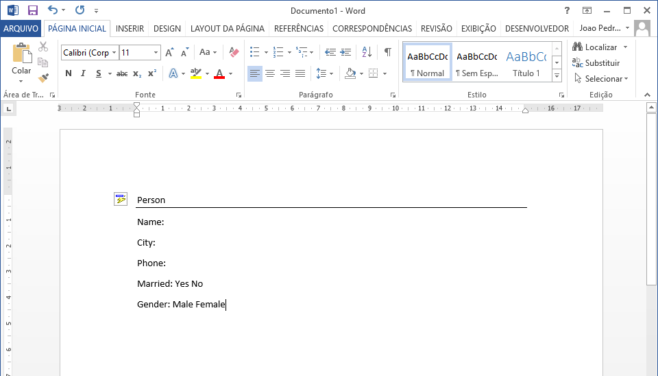
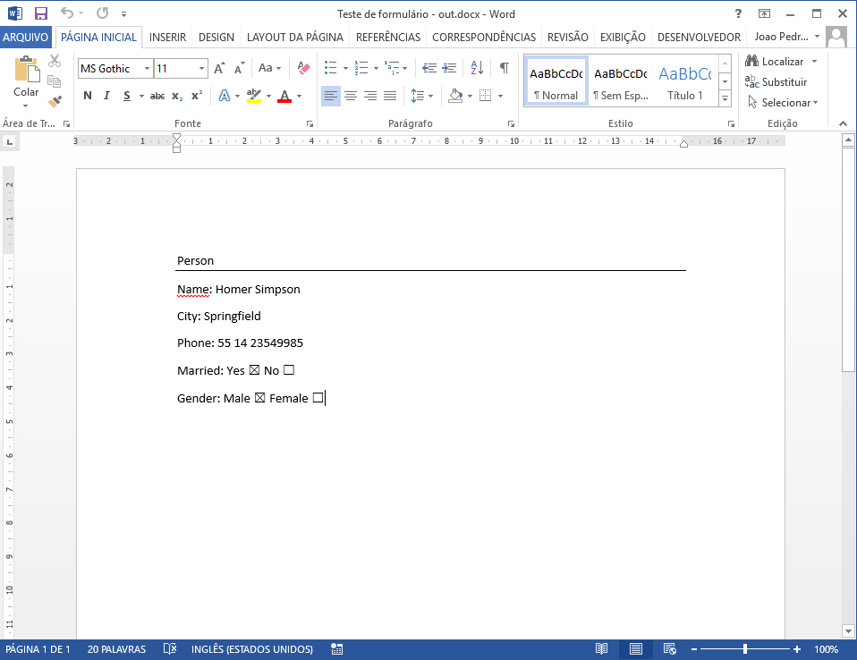

# A Java-based application used to fill word (docx) files.

## Introduction

Companies are every time demanding more automation tools for documents generation, these tools are used to speed up contracts generation and client product/formulary documents. To support this necessity, tools like Word have been widely used to create these documents and have been integrated with different technologies that fill data in template files. In this context, the Java programming language combined with the library DOCX4J allow, by programming, generate word documents files filled with data from XML files. However, besides the extensive documentation of the library and community, this article proposes to offer a very simple guide (step-by-step) to generate word document files using the Java library DOCX4J. This necessity is due to the lack of simple and informal guides available on the internet.

## Guide to generate word files with Java

The WORD document files generation is based on XML source files. In this example, the XML used applied to the word document template is presented below:

```xml
<?xml version="1.0" encoding="UTF-8" standalone="yes"?>
<root>
    <person>
        <name></name>
        <city></city>
        <phone></phone>
        <marriedYes></marriedYes>
        <marriedNo></marriedNo>
        <male></male>
        <female></female>
    </person>
</root>
```

With the XML structure defined, open the Word (Word 2010 in this tutorial) and enable the developer mode following the steps below:
* Select File tab > Options > Customize Ribbon
* In the right side of the Word Options dialog box, select Main Tabs and turn on the Developer tab.
* Click OK.

With the Developer tab activated, create a simple document template (Figure 1).



<figure><figcaption>The discourse logo</figcaption></figure>

After that, go to the Developer Tab and click in the "XML Mapping Panel" button to open more options about XML data, then in the "Custom XML Part" combo select "Add a new part" (Figure 2).


Then, use the text cursor to select the position to install a new control, then add the control using the XML Structure with the desired control type. You can configure text inputs like in Figure 3.


To exemplify another control example, in figure 4 is ilustrated a checkbox configuration.


After that, save the word document and create a simple Java project using the [DOCX4J](https://www.docx4java.org/) library. The code necessary to process the word document is simple, the algorithm below exemplify how to use the DOCX4J library.

```java
package com.github.schmittjoaopedro;

import org.docx4j.Docx4J;
import org.docx4j.openpackaging.packages.WordprocessingMLPackage;

import java.io.File;
import java.io.FileInputStream;

public class WordTest {

    public static final String input_DOCX = "E:\\Temp5\\Word document template.docx";

    public static final String input_XML = "E:\\Temp5\\Word document data.xml";

    public static final String output_DOCX = "E:\\Temp5\\Word document output.docx";

    public static void main(String[] args) throws Exception {
        WordprocessingMLPackage wordMLPackage = Docx4J.load(new File(input_DOCX));
        FileInputStream xmlStream = new FileInputStream(new File(input_XML));
        Docx4J.bind(wordMLPackage, xmlStream, Docx4J.FLAG_BIND_INSERT_XML | Docx4J.FLAG_BIND_BIND_XML | Docx4J.FLAG_BIND_REMOVE_SDT);
        Docx4J.save(wordMLPackage, new File(output_DOCX), Docx4J.FLAG_NONE);
        System.out.println("Saved: " + output_DOCX);
    }

}
```

Execute the above program with the XML data presented below.

```xml
<?xml version="1.0" encoding="UTF-8" standalone="yes"?>
<root>
    <person>
        <name>Homer Simpson</name>
        <city>Springfield</city>
        <phone>55 14 23549985</phone>
        <marriedYes>true</marriedYes>
        <marriedNo>false</marriedNo>
        <male>true</male>
        <female>false</female>
    </person>
</root>
```

If everything works without any error, a word document output file will be generated, like the presented in figure 5.

